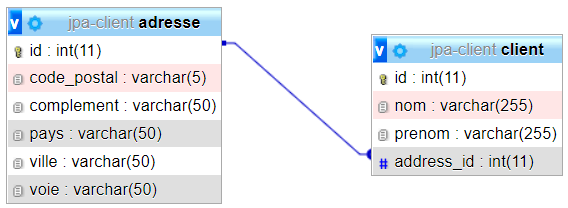

# 6 - @OneToOne (corrigé) : ASSOCIATION UNIDIRECTIONNELLE DE 1 VERS 1 (**client02**)

>Un Client a une et une seule Adresse. Seul un objet client peut accéder à son adresse. L'Adresse ne peut pas accéder à son client.

TRAVAIL A REALISER :

- mettre en place une association unidirectionnelle de **un vers un** entre **Client** et **Adresse**.

- créer le projet **client02**
- reprendre la structure et le contenu du projet **client01** (voir pinard02 si vous avez oublié comment faire !)

- Créer les classes **Client** et **Adresse** avec les attributs suivants :

```java
    private int id;
    private String nom;
    private String prenom;
    private Adresse adresse;
```

- la clé primaire sera représentée par le champ **id** et sera autogénérée.

- la classe **Adresse** comportera les attributs suivants :

```java
    private int id;
    private String voie;
    private String complement;
    private String codePostal;
    private String ville;
    private String pays;
```

- la clé primaire sera représentée par le champ **id** et sera autogénérée.

## Mise en place de l’association unidirectionnelle de un vers un

La navigabilité de l’association est de **Client vers Adresse**.

L’annotation **@OneToOne** sur la méthode ***getAdresse()** de Client indique la navigabilité de **Client vers Adresse**

Voici le code :

```java
@OneToOne(cascade={CascadeType.ALL})
	@JoinColumn(name="ADDRESS_ID")
	public Adresse getAdresse() {
		return adresse;
	}
```

>L’absence de méthode **getClient()** dans la classe **Adresse** indique le caractère unidirectionnel de l’association.

Pas de difficulté particulière, juste une classe et un repository supplémentaire en plus.

- Voici le code complet de votre classe Contrôleur **ClientController** pour vous aider à tester le projet :

```java
 @CrossOrigin("*")
@RestController
public class ClientController {

	@Autowired
	private ClientRepository clientRepository;

	@GetMapping("/accueil")
	@ResponseBody
	public String home()
	{

		Client client1=new Client("MARTIN","Jean");
		client1=clientRepository.save(client1);

		Adresse adresse1=new Adresse("5, rue du Renard","","75015","PARIS","FRANCE");
		Client client2=new Client("DUPONT","sophie",adresse1);
		clientRepository.save(client2);

		Client client3=new Client("DURAND","Pierre",new Adresse("20, boulevard Gambetta","","78300","POISSY","FRANCE"));
		client3=clientRepository.save(client3);

		Client client4=new Client("MADEC","Denis",new Adresse("29, boulevard Devaux","","78300","POISSY","FRANCE"));
		client4=clientRepository.save(client4);

		System.out.println("Liste de tous les clients:");
		this.affiche(clientRepository.findAll());


		System.out.println("MARTIN Jean habite désormais avec DUPONT Sophie");
		client1.setAdresse(adresse1);
		clientRepository.save(client1);


		System.out.println("DURAND Pierre change d'adresse");
		Adresse newAdresse = new Adresse("6 place de l'église","","35740","PACE","FRANCE");
		client3.setAdresse(newAdresse);
		clientRepository.save(client3);
		

		System.out.println("MADEC Denis se désinscrit");
		clientRepository.delete(client4);

		System.out.println("Liste de tous les clients:");
		this.affiche(clientRepository.findAll());

		StringBuilder sb = new StringBuilder();
		sb.append("<h1>Regardez dans votre console et dans votre base de données MySQL <strong>JPA</strong></h1>");
		sb.append("<a href='http://localhost:8080/clients'>Voir la liste des clients enregistrés</a>");
		return  sb.toString();

	}

	@GetMapping(value = "/clients")
	public ResponseEntity<?> getAll(){
		List<Client> liste = null;
		try
		{
			liste = clientRepository.findAll();
		} catch (Exception e) {
			return ResponseEntity.status(HttpStatus.NOT_FOUND).body(null);
		}

		return ResponseEntity.status(HttpStatus.OK).body(liste);
	}

	/**
	 * Méthode pour affichage dans la console
	 * @param liste
	 */
	private void affiche(Collection<Client> liste)
	{

		for (Client client : liste) {

			System.out.println(client);
		}


	}
}
```

- Lancez l'application Spring Boot et observez les tables générées dans votre base de données.

- Appelez la méthode **home()** dans votre navigateur pour initialiser les clients en base de données en saisissant l'url ci-dessous dans votre navigateur :
  
[http://localhost:8080/accueil](http://localhost:8080/accueil)

- Ensuite cliquez sur ce lien [http://localhost:8080/clients](http://localhost:8080/clients) pour visualiser vos clients enregistrés.

Voici la structure des tables que vous devez obtenir :



```sql
CREATE TABLE IF NOT EXISTS `adresse` (
  `id` int(11) NOT NULL AUTO_INCREMENT,
  `codePostal` varchar(255) DEFAULT NULL,
  `complement` varchar(255) DEFAULT NULL,
  `pays` varchar(255) DEFAULT NULL,
  `ville` varchar(255) DEFAULT NULL,
  `voie` varchar(255) DEFAULT NULL,
  PRIMARY KEY (`id`)
) ENGINE=InnoDB AUTO_INCREMENT=6 DEFAULT CHARSET=utf8;

CREATE TABLE IF NOT EXISTS `client` (
  `id` int(11) NOT NULL AUTO_INCREMENT,
  `nom` varchar(255) DEFAULT NULL,
  `prenom` varchar(255) DEFAULT NULL,
  `ADDRESS_ID` int(11) DEFAULT NULL,
  PRIMARY KEY (`id`),
  KEY `ADDRESS_ID` (`ADDRESS_ID`)
) ENGINE=InnoDB AUTO_INCREMENT=5 DEFAULT CHARSET=utf8;

ALTER TABLE `client`
  ADD CONSTRAINT `client_ibfk_1` FOREIGN KEY (`ADDRESS_ID`) REFERENCES `adresse` (`id`);

```

[Retour vers les exercices](https://pbouget.github.io/cours/framework-back/1-jpa-orm/mapping-orm.html)

[Retour vers le cours complet](https://pbouget.github.io/cours/)